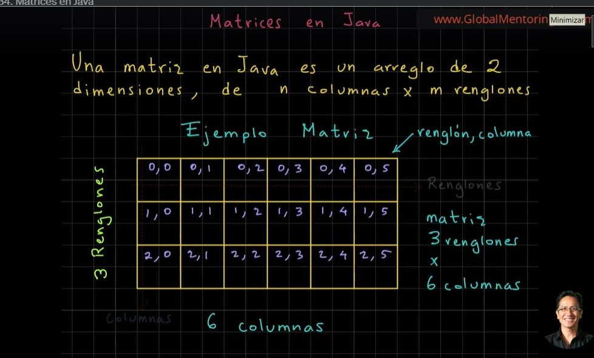
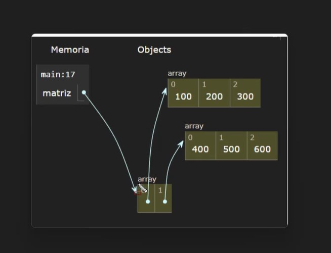
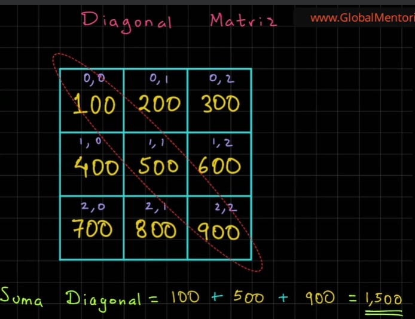

# Seccion10: Matrices en java
* 
    * 
* [V135 Ejemplo de Matrices en Java - .java](V135_Ejemplo_de_Matrices_en_Java/src/Matrices.java)
* [V136 Recorrer una Matriz en java - .java](V136_Recorrer_una_Matriz_en_Java/src/Matrices.java)
* [V137 Sintaxis Simplificada en Java - .java](V137_Sintaxis_Simplificada_en_Java/src/Matrices.java)
* [V138 Introducir datos de manera dinámica en una Matriz en Java](V138_Introducir_Datos_en_una_Matriz_en_Java/src/Matrices.java)
* [V139 Reto - Suma Diagonal de una Matriz](V139_Reto_Suma_Diagonal_de_una_matriz/src/RetoSumaDiagonal.java)
    
* [V140 Solución - Suma Diagonal de una matriz](V140_Solucion_Suma_Diagonal_de_una_Matriz/src/DiagonalMatriz.java)

[Volver](../)