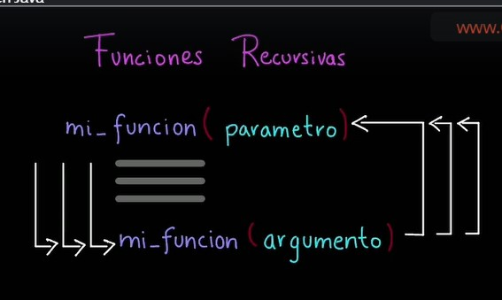
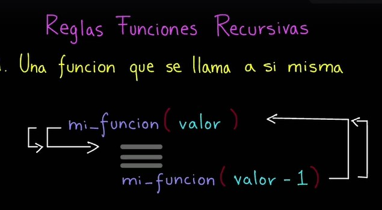
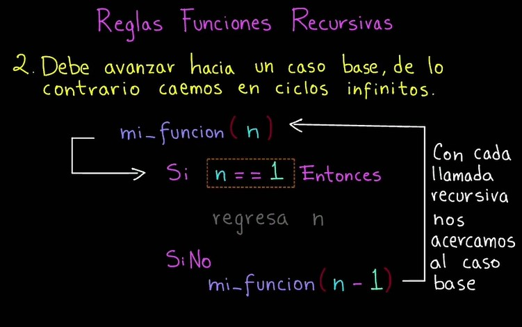

# Seccion11: Funciones en java
* [V141 - Funciones en Java - Video Udemy](https://www.udemy.com/course/universidad-java-especialista-en-java-desde-cero-a-master/learn/lecture/44849933#overview)
    - Una función es un bloque de código reutilizable, que realiza una
        operación en particular.
    - Puede tener parámetros de entrada y también puede devolver un valor
        de salida.
    - Una función representa 1 acción.
* [V142 Ejemplo de Función en Java - .java](V142_Ejemplo_de_Funciones_en_Java/src/Funciones.java)
* [V143 Ejemplo Función sumar - .java](V143_Ejemplo_Funcion_Sumar/src/FuncionSumar.java)
* [V144 Ejemplo Función esPar - .java](V144_Ejemplo_funcion_esPar/src/FuncionEsPar.java)
* [V145 Funciones Recursivas en Java - Video Udemy](https://www.udemy.com/course/universidad-java-especialista-en-java-desde-cero-a-master/learn/lecture/44849963#overview)
    - Una función recursiva es una función que se vuelve a llamar a si misma
        tantas veces sea necesario.
    
    - 1 La primer regla es que una función se tiene que llamar a si misma.
    
    - Debe Avanzar hacia un caso base, de lo contrario caemos en ciclos infinitos.
    
    

[Volver](../)